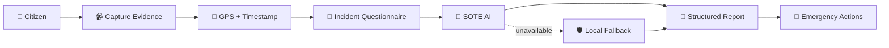
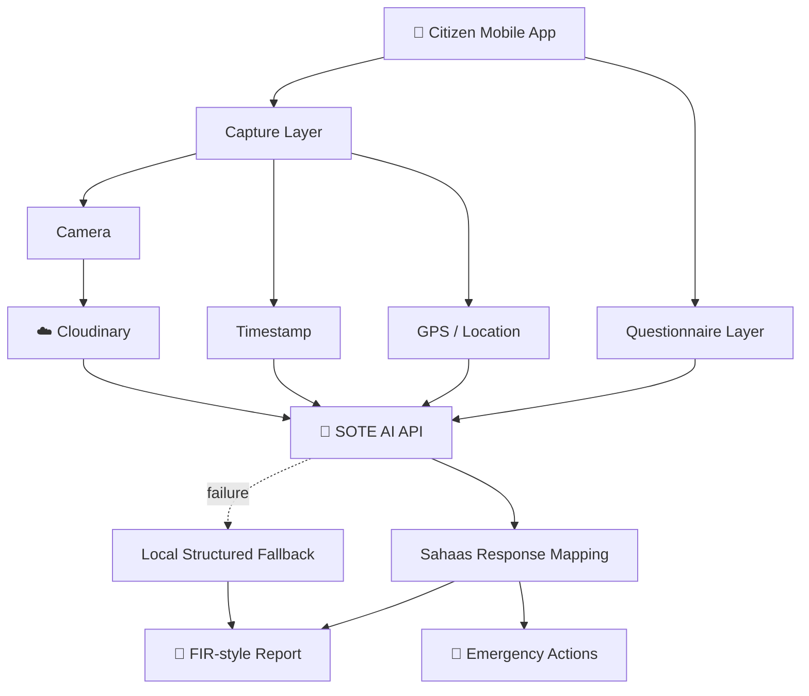

<div align="center">

# 🛡️ SAHAAS

### *Courage to Act. Technology to Help.*

**AI-assisted emergency incident reporting — from citizen evidence to structured response.**

<br/>

[](https://reactnative.dev/)
[](https://expo.dev/)
[](https://soteai.onrender.com)
[](https://www.sih.gov.in/)

<br/>

**SIH 2026 • PS: SIH26202 • Student Innovation • Software**

**Team ID:** `180076` &nbsp; **Team:** `TEAM_LOGIX`

</div>

---

## 🚨 The Idea

Emergency incidents often begin with a citizen holding a phone — but the information reaching responders may be incomplete, unstructured, or missing important context.

**Sahaas** turns first-hand citizen evidence into a structured digital incident workflow:

> 📹 **Capture** → 📍 **Locate** → 📝 **Describe** → 🤖 **Analyze** → 📄 **Report** → 🚑 **Respond**

The project is designed as a hackathon prototype for rapid, structured emergency incident reporting and AI-assisted decision support.

---

## ✨ What Sahaas Does

| Capability | What it provides |
|---|---|
| 📹 **Incident Capture** | Records incident video from the device camera |
| 📍 **Location Context** | Collects GPS coordinates associated with the incident |
| ⏱️ **Timestamping** | Associates captured evidence with capture time |
| 📝 **Structured Questionnaire** | Collects injuries, vehicle information, participant count, and incident description |
| 🤖 **SOTE AI Analysis** | Sends incident information to the configured SOTE AI backend |
| 📄 **FIR-style Report** | Builds a structured incident/report document and PDF |
| ☁️ **Evidence Upload** | Uploads captured video using the configured Cloudinary service |
| 🚨 **Emergency Actions** | Provides configurable police, ambulance, and fire response actions |
| 🌐 **Multi-language UI** | Includes English, Hindi, Telugu, and Gujarati strings |
| 🛡️ **Fallback Processing** | Maintains structured local reporting when remote analysis is unavailable |

---

## 🔄 End-to-End Workflow



---

## 🧠 SOTE AI Integration

Sahaas uses a separate **SOTE AI HTTP backend** for incident-analysis related processing.

### Integration

| Component | Value |
|---|---|
| Backend | SOTE AI |
| Default endpoint | [soteai.onrender.com](https://soteai.onrender.com) |
| Frontend service | `src/services/soteService.js` |

The integration can:

1. Send incident metadata and an available video URL to the configured analysis service.
2. Use the emergency-analysis path when required.
3. Map the returned response into the Sahaas reporting structure.
4. Fall back to structured local report generation when remote analysis is unavailable.

> **AI assists the workflow; humans retain authority.**
>
> SOTE AI output is prototype decision-support data. It is not, by itself, an authoritative legal, medical, police, or emergency-service determination.

---

## 🏗️ Architecture



---

## 📱 App Flow

```text
Home
  ↓
Capture
  ↓
Questionnaire
  ↓
SOTE AI Analysis
  ↓
FIR / Report
  ↓
Emergency Dispatch
  ↓
Call Confirmation
```

### Main Screens

| Screen | Purpose |
|---|---|
| 🏠 **Home** | Entry point and language selection |
| 📹 **Capture** | Records incident evidence and collects location context |
| 📝 **Questionnaire** | Collects structured incident information |
| 🤖 **Analysis** | Displays incident-processing stages |
| 📄 **FIR** | Reviews and exports the generated report |
| 🚨 **Dispatch** | Presents configurable emergency actions |
| 📞 **Call** | Provides call/dispatch confirmation flow |

---

## 🧩 Technology Stack

| Layer | Technology |
|---|---|
| **Mobile** | React Native 0.81.5 |
| **Platform** | Expo SDK 54 |
| **Navigation** | React Navigation |
| **Camera** | expo-camera |
| **Location** | expo-location |
| **File Handling** | expo-file-system |
| **Video Storage** | Cloudinary |
| **PDF** | expo-print + expo-sharing |
| **Icons** | @expo/vector-icons |
| **AI** | SOTE AI HTTP API |
| **Languages** | English • Hindi • Telugu • Gujarati |

---

## 📂 Project Structure

```text
SAHAAS/
├── App.js
├── index.js
├── app.json
├── babel.config.js
├── package.json
├── package-lock.json
├── START_EXPO.bat
├── .env.example
│
├── assets/
│   ├── icon.png
│   ├── splash-icon.png
│   └── ...
│
└── src/
    ├── components/
    │   └── ParticleBackground.js
    │
    ├── constants/
    │   └── index.js
    │
    ├── screens/
    │   ├── HomeScreen.js
    │   ├── CaptureScreen.js
    │   ├── QuestionnaireScreen.js
    │   ├── AnalysisScreen.js
    │   ├── FIRScreen.js
    │   ├── DispatchScreen.js
    │   └── CallScreen.js
    │
    └── services/
        ├── emailService.js
        ├── firService.js
        ├── pdfService.js
        ├── smsService.js
        ├── soteService.js
        └── videoUploadService.js
```

---

## ⚡ Quick Start

### Prerequisites

- Node.js
- npm
- Expo Go on an Android or iOS device

### 1. Clone

```bash
git clone https://github.com/aayush-sinha24/SAHAAS.git
cd SAHAAS
```

### 2. Install dependencies

```bash
npm install
```

### 3. Configure local environment

Create the local environment file:

```powershell
Copy-Item .env.example .env.local
```

Then enter the configuration required for your local/demo environment.

### 4. Start Expo

```bash
npx expo start
```

For a physical device on the same Wi-Fi network:

```bash
npx expo start --lan
```

Windows users can also use:

```text
START_EXPO.bat
```

---

## 🔐 Environment Configuration

The repository contains `.env.example` with placeholders.

| Variable | Purpose |
|---|---|
| `EXPO_PUBLIC_SOTE_API_URL` | SOTE AI backend URL |
| `EXPO_PUBLIC_SOTE_API_KEY` | SOTE AI API key |
| `EXPO_PUBLIC_CLOUDINARY_CLOUD_NAME` | Cloudinary cloud name |
| `EXPO_PUBLIC_CLOUDINARY_UPLOAD_PRESET` | Cloudinary upload preset |
| `EXPO_PUBLIC_POLICE_PHONE` | Prototype police contact |
| `EXPO_PUBLIC_AMBULANCE_PHONE` | Prototype ambulance contact |
| `EXPO_PUBLIC_FIRE_PHONE` | Prototype fire contact |
| `EXPO_PUBLIC_EMAIL_SERVICE_ID` | Email service configuration |
| `EXPO_PUBLIC_EMAIL_TEMPLATE_ID` | Email template configuration |
| `EXPO_PUBLIC_EMAIL_PUBLIC_KEY` | Email public configuration |
| `EXPO_PUBLIC_EMAIL_TO` | Destination email |
| `EXPO_PUBLIC_SMS_API_KEY` | SMS service configuration |

### ⚠️ Security

**Never commit `.env.local`.**

The repository's `.gitignore` excludes it.

Also note that Expo `EXPO_PUBLIC_*` values are exposed to the client application. They should therefore **not be considered true server-side secrets**. A production architecture should place sensitive credentials behind a protected backend.

---

## 📄 FIR-style Report Generation

The reporting workflow is separated into dedicated services:

| Service | Responsibility |
|---|---|
| `src/services/soteService.js` | SOTE AI integration |
| `src/services/firService.js` | Structured incident/report data |
| `src/services/pdfService.js` | PDF generation |

The generated document is a **prototype report**.

It should not be represented as an officially registered or legally valid FIR without the required police/legal process and authorization.

---

## 🚨 Emergency Response Workflow

Sahaas provides configurable emergency actions for the prototype workflow.

The dispatch interface is implemented in:

`src/screens/DispatchScreen.js`

Emergency contact configuration is maintained in:

`src/constants/index.js`

Before any real-world deployment, demonstration contacts and integrations must be replaced with authorized emergency-service integrations.

Sahaas should not be treated as an official emergency-service system unless separately authorized and integrated with the relevant authorities.

---

## 🛡️ Resilience & Fallback

Sahaas retains a structured fallback path when remote AI analysis is unavailable.

```text
Remote SOTE AI
      │
      ├── Available ──→ AI result ──→ Report
      │
      └── Unavailable ─→ Local fallback ─→ Report
```

This supports prototype and demonstration resilience without claiming that the fallback replaces authoritative emergency or legal systems.

---

## 🎯 Hackathon Context

### Smart India Hackathon 2026

| Field | Value |
|---|---|
| **Problem Statement ID** | `SIH26206` |
| **Problem Statement** | `Student Innovation` |
| **Theme** | `Smart Automation` |
| **Category** | `Software` |
| **Team ID** | `180076` |
| **Team** | `TEAM_LOGIX` |
| **Project** | `Sahaas` |

Sahaas is presented as a software prototype focused on structured emergency incident reporting and AI-assisted response workflows.

---

## 📊 Prototype at a Glance

<div align="center">

| 📹 Evidence | 📍 Context | 🤖 Intelligence | 📄 Reporting | 🚨 Response |
|:---:|:---:|:---:|:---:|:---:|
| Capture | GPS + Time | SOTE AI | PDF | Actions |

</div>

The prototype connects these stages into a single citizen-facing workflow.

---

## ⚠️ Prototype Limitations

Sahaas is a **hackathon/prototype application**.

It does not guarantee:

- AI accuracy
- official legal validity of generated reports
- official police registration of an FIR
- guaranteed emergency dispatch
- production-grade evidence-chain integrity
- production-scale availability

AI-generated information should be reviewed by an appropriate human authority before operational or legal use.

---

<details>
<summary><strong>🧪 Development & Testing</strong></summary>

The public project has been tested for Expo web bundling using:

```bash
npx expo export --platform web
```

The repository is intended for:

- hackathon demonstration
- prototype evaluation
- further development
- experimentation with emergency incident workflows

</details>

---

## 👥 Team

<div align="center">

### TEAM_LOGIX

**Sahaas — Emergency Incident Response**

*Courage to Act. Technology to Help.*

</div>

---

## 📜 License

This repository does not currently include a license file. Add a license before distributing the project under specific open-source terms.

---

<div align="center">

### 🛡️ SAHAAS

**Capture. Context. Intelligence. Response.**

</div>
